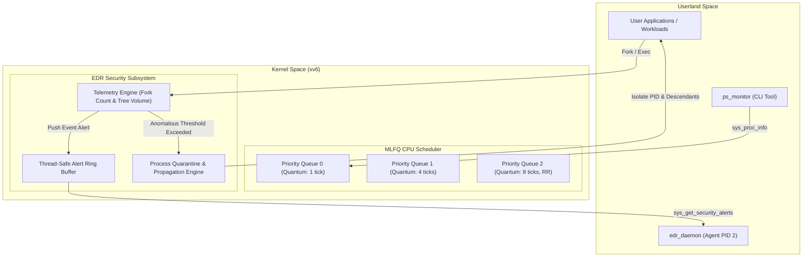

# 🛡️ xv6-edr-mlfq: Secure & High-Performance RISC-V Operating System Kernel

[](https://github.com/Boy1Lane/xv6-edr-mlfq/actions/workflows/ci.yml)
[](LICENSE)
[](https://riscv.org/)
[-green.svg)]()
[]()

> **xv6-edr-mlfq** is an advanced, production-standard extension of MIT's **xv6 RISC-V Operating System Kernel**. It integrates a **3-Queue Multi-Level Feedback Queue (MLFQ) CPU Scheduler** alongside an **Endpoint Detection and Response (EDR) Security Subsystem** featuring real-time telemetry, automated anomaly mitigation, and process tree quarantine isolation.

---

## 🔬 Core Architecture Overview


```mermaid
graph TD
    subgraph "Userland Space"
        Daemon["edr_daemon (Agent PID 2)"]
        Monitor["ps_monitor (CLI Tool)"]
        Workload["User Applications / Workloads"]
    end

    subgraph "Kernel Space (xv6)"
        subgraph "MLFQ CPU Scheduler"
            Q0["Priority Queue 0 (Quantum: 1 tick)"]
            Q1["Priority Queue 1 (Quantum: 4 ticks)"]
            Q2["Priority Queue 2 (Quantum: 8 ticks, RR)"]
        end

        subgraph "EDR Security Subsystem"
            Telemetry["Telemetry Engine (Fork Count & Tree Volume)"]
            RingBuf["Thread-Safe Alert Ring Buffer"]
            Quarantine["Process Quarantine & Propagation Engine"]
        end
    end

    Workload -->|Fork / Exec| Telemetry
    Telemetry -->|Anomalous Threshold Exceeded| Quarantine
    Telemetry -->|Push Event Alert| RingBuf
    RingBuf -->|sys_get_security_alerts| Daemon
    Quarantine -->|Isolate PID & Descendants| Workload
    Monitor -->|sys_proc_info| Q0
```

---

## ✨ Key Features

### ⚡ 1. Multi-Level Feedback Queue (MLFQ) CPU Scheduler
* **3-Level Queue Architecture**:
  * **Queue 0 (Highest)**: Quantum = 1 tick (Interactive priority).
  * **Queue 1 (Medium)**: Quantum = 4 ticks.
  * **Queue 2 (Lowest)**: Quantum = 8 ticks (Round-Robin fallback).
* **Anti-Gaming Mechanism**: Measures cumulative CPU execution time per time-slice to prevent I/O exploitation.
* **Starvation Prevention (Aging)**: Promotes process priority periodically to prevent starvation of CPU-bound tasks.
* **SMP-Safe (P2)**: `mlfq_tick()`/`has_higher_priority()` hold `p->lock`/`tickslock`; verified with `-smp 3`.
* **Round-Robin Baseline Toggle**: Supports comparative benchmarking via compilation flag (`-DSCHED_MODE=1`).

### 🛡️ 2. Endpoint Detection and Response (EDR) Security Subsystem
* **Real-time Telemetry Engine**: Monitors process tree creation (`is_descendant`), process volume, and fork rate anomalies.
* **Spinlock-Guarded Telemetry Ring Buffer**: Decoupled kernel-to-userland event streaming, protected by a dedicated `alert_lock` with drop accounting (`alerts_dropped`) on overflow.
* **SHA-256 Binary Identity Whitelist (Signed, P2)**: Whitelist/trust privileges are bound to the *content hash* of the binary at exec-time, plus a build-time HMAC signature (`wl_signature`) verified at boot (`whitelist_verify()`).
* **Adaptive Anomaly Threshold**: The fork-rate detection window widens with an exponential moving average of system-wide fork activity, suppressing false positives under legitimately busy workloads.
* **Global PID-Pressure Limiter (P2)**: System-wide live-process count (`count_live_processes()`) denies new forks (returns -1) with `EDR_REASON_GLOBAL_PRESSURE` and sets `is_sandboxed = 1 (WARN (1), không deschedule, alert 1 lần)` (`kernel/sysproc.c:66-76`) để `user/pressure.c` vẫn runnable và in `GLOBAL_PRESSURE_LIMITED`.
* **Persistent Alert Log (P2)**: Every alert is appended to `/edr.log` via `O_APPEND` for post-mortem forensics (`cat /edr.log` / `edr_log`).
* **Automated Anomaly Mitigation & Quarantine**:
  * Automatically sandbox/quarantine anomalous process trees (root + all descendants) with `is_sandboxed = 2 (QUARANTINED (2))`.
  * Quarantined processes are descheduled and their sensitive system calls (`fork`, `exec`, `sbrk`) are rejected with `-1`.
  * Trusted admin release via `sys_unquarantine` (daemon-only); kernel-side timeout force-releases quarantined processes even if the daemon dies.
* **SMP-Safe (P2)**: All hot paths use `p->lock`/`tickslock`/`edr_global_lock` + atomics; default `-smp 3`, CI stress-tested.
* **False-Positive Resistant**: Verified under heavy legitimate I/O workloads (`stressfs`).

---

## 📊 Comparative Performance Benchmarks

Measured automatically by the CI benchmark job (5 runs per cell, median ± stdev,
`-smp 3`, see `benchmark_results.csv` artifact):

| Metric | MLFQ Scheduler | Round-Robin Baseline |
| :--- | :---: | :---: |
| **CPU-bound Throughput (4 workers, median)** | 17 ticks | 17 ticks |
| **Interactive Response w/ background load (median)** | **2 ticks** | 8 ticks |

Interpretation: MLFQ matches RR on raw CPU-bound throughput while making an
interactive task under contention **~4x more responsive**.

---

## 🛠️ Quickstart Guide

### 🐳 Option A: 1-Click Setup with Docker (Recommended)

No local RISC-V toolchain installation required!

```bash
# Clone repository
git clone https://github.com/Boy1Lane/xv6-edr-mlfq.git
cd xv6-edr-mlfq

# Launch interactive environment inside container
docker compose -f docker/docker-compose.yml run xv6-dev

# Inside Docker container:
make qemu
```

### 🐧 Option B: Native Building (Linux / WSL2)

#### Prerequisites
```bash
sudo apt-get update
sudo apt-get install -y build-essential gcc-riscv64-unknown-elf qemu-system-misc python3
```

#### Build & Run
```bash
# Build and boot kernel with MLFQ Scheduler
make qemu

# Build and boot kernel with Round-Robin Scheduler (for benchmarking)
make qemu-rr

# Run full automated Python test suite
make test
```

---

## 🧪 Running Automated Test Suite

```bash
# Run core system usertests
make test-usertests

# Run EDR Security Subsystem tests
make test-edr

# Run MLFQ Scheduler demotion tests
make test-mlfq

# Run False-Positive resilience tests (stressfs)
make test-false-positive

# Run admin-release (unquarantine) flow tests
make test-unquarantine

# Run Global Pressure limiter tests (P2)
make test-global-pressure

# Run Persistent Log tests (P2)
make test-persistent-log

# Run Performance Comparison Benchmark (5 runs/cell, stats + CSV artifact)
make test-benchmark
```

---

## 📂 Project Repository Structure

```text
xv6-edr-mlfq/
├── .github/workflows/   # Automated CI/CD Workflows (build, tests, benchmark, lint)
├── docker/              # Dockerfile & Docker-Compose environment
├── docs/                # Architectural & Technical documentation (ARCHITECTURE.md)
├── scripts/             # Python test harness + whitelist generator (gen-whitelist.sh) + verify.sh
├── kernel/              # Core OS Kernel sources (edr.c, sha256.c, proc.c, trap.c, exec.c)
├── user/                # Userland utilities & tests (edr_daemon, ps_monitor, unquarantine, bomb, pressure, edr_log, bench_*)
├── mkfs/                # File system image generator
├── Makefile             # Unified build system (MLFQ/RR modes, whitelist, fmt, docker)
├── DESIGN.md            # Academic & Architectural Design Document
├── CONTRIBUTING.md      # Code standards & contribution guidelines
└── README.md            # Project Landing Documentation
```

---

## 📖 Further Documentation

* [Architectural Specification (`docs/ARCHITECTURE.md`)](docs/ARCHITECTURE.md) - In-depth breakdown of MLFQ algorithms & EDR internals.
* [Academic Design Document (`DESIGN.md`)](DESIGN.md) - Theoretical foundations and mathematical formulations.
* [Contribution Guidelines (`CONTRIBUTING.md`)](CONTRIBUTING.md) - Code style and pull request guidelines.

---

## 📜 License

This project is open-source software licensed under the [MIT License](LICENSE).
